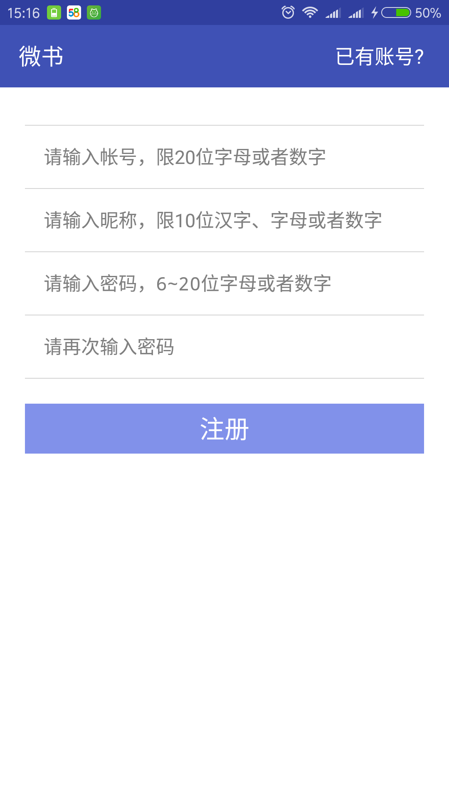
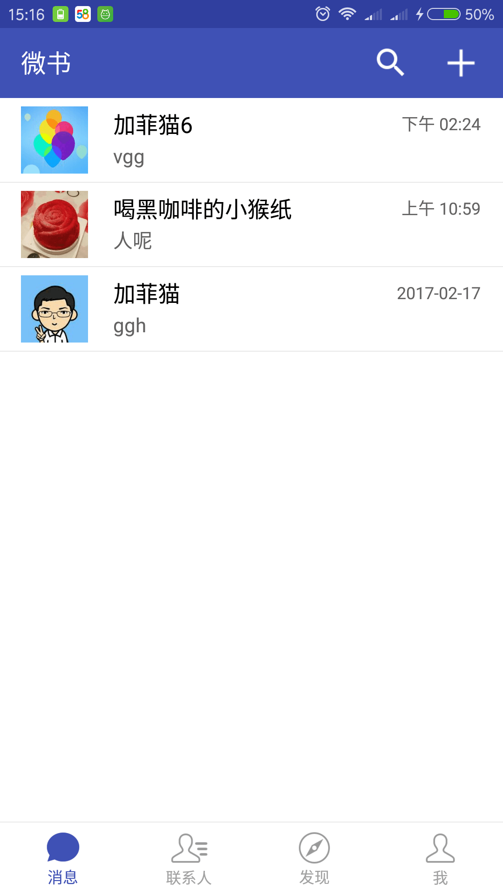
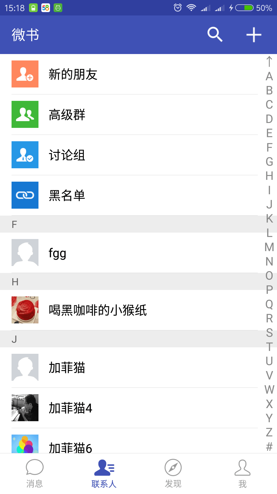
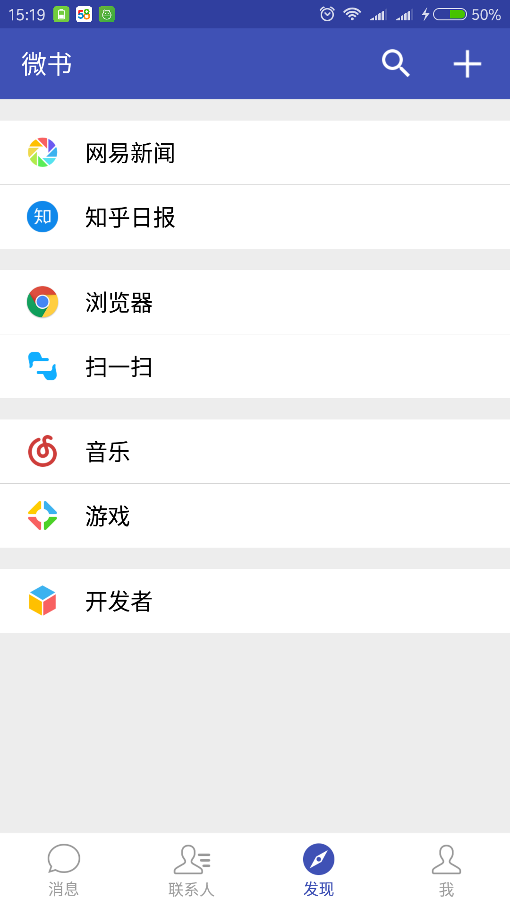
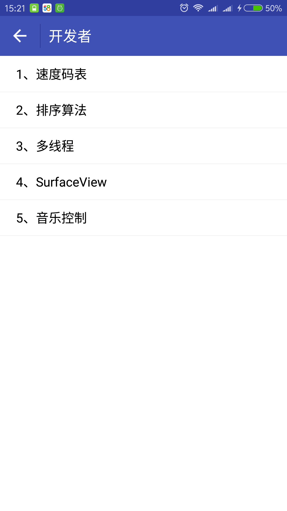
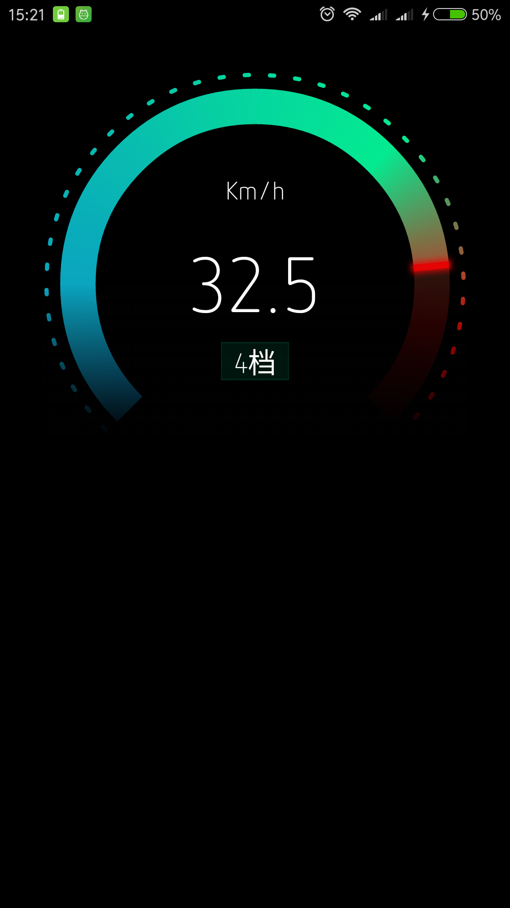
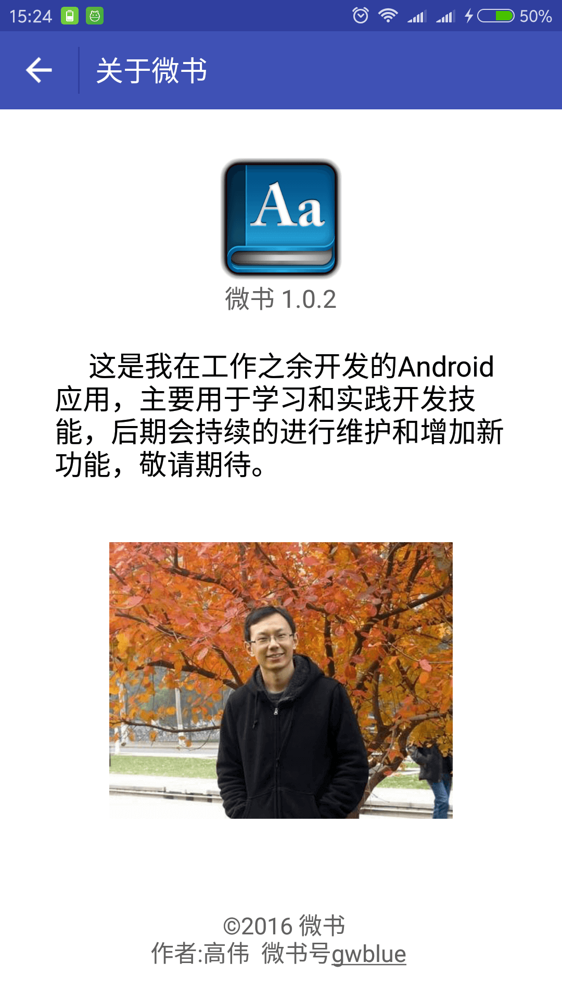

# 微书

一款模仿微信界面的Android App，既是一款聊天工具，也是一款新闻客户端，更是一款开发者用来学习和实践的框架平台。

[下载地址](https://www.pgyer.com/weishu2)

# 技术
- 即时通讯：`Netease.im`
- 数据缓存：`ACache`
- 图片相关：`Glide` `PhotoView` `UCrop`
- 网络加载：`Retrofit2` `okhttp3` `volley`
- 控制：`RxJava`
- 调试工具：`Logger` `Bugly`
- 解析：`Gson`
- 事件分发：`Eventbus`
- 其他：`Butterknife`

# 界面
　
　
　

　
　
　

　
　
　

# 作者
- 微信：122525660
- 微书：gwblue
- 邮箱：gwblue@163.com

# License
Apache